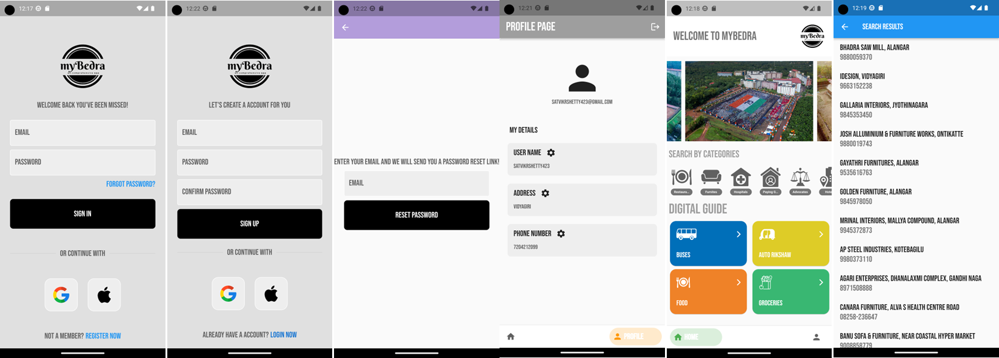
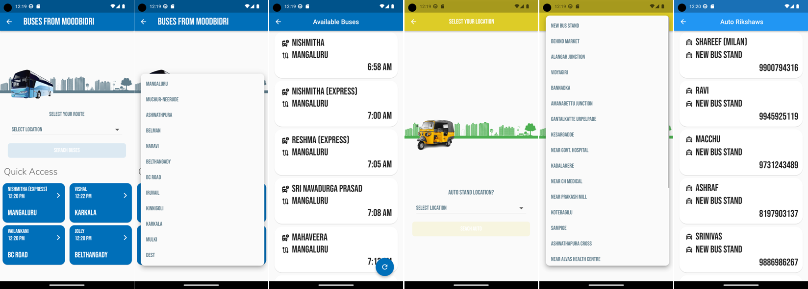
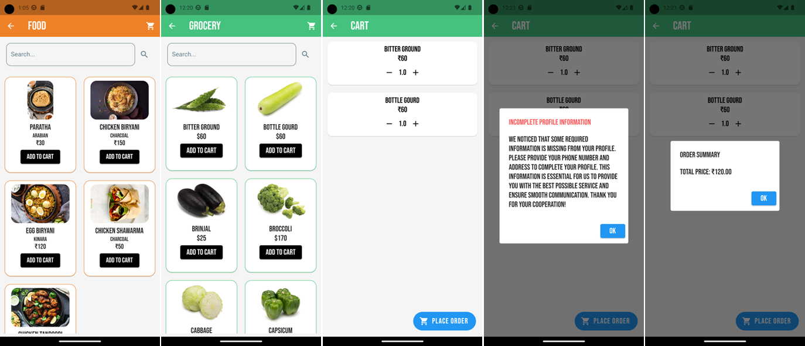

# MyBedra

## Introduction

Hi all, this is my BCA final year project named **MyBedra**. It's a comprehensive Flutter app designed to provide essential town information at your fingertips. Whether you need the contact details of a local doctor, plumber, electrician, lawyer, or auto driver, or you want to check bus timings, order groceries, or food from restaurants, MyBedra has got you covered.

## Features

- **Local Directory**: Find phone numbers of doctors, plumbers, electricians, lawyers, and more.
- **Transport Information**: Get contact information for auto drivers and view bus timings.
- **Order Services**: Order groceries and food from local restaurants directly through the app.

## Screenshots

## Presentation

For a detailed overview of the project, check out the [presentation](myBedra.pptx).

## Contact

For any inquiries, please contact:
- **Name**: [Satvik R Shetty](mailto:satvikrshetty423@gmail.com)
- **LinkedIn**: [Satvik R Shetty](https://www.linkedin.com/in/satvik-r-shetty/)
- **GitHub**: [satvik423](https://github.com/satvik423)

---

Thank you for checking out MyBedra! We hope it serves as a valuable resource for your town's residents.
